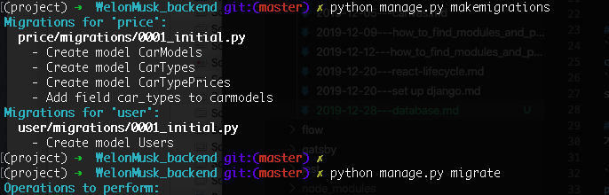
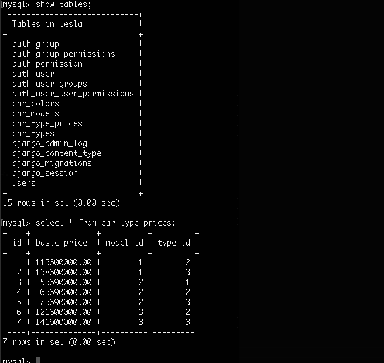

# 1. MY SQL DATABASE 깔끔하게 초기화 하기
my sql > DROP DATABASE [name]
django > manage.py 있는 루트 디렉토리에서 다음 명령어 실행
전체 앱의 migrations 디렉토리 안에 makemigrations 결과로 만들어진 0001_initial.py 들을 삭제한다.
```
find . -path "*/migrations/*.py" 
find . -path "*/migrations/*.py" -not -name "__init__.py" -delete
```

# 2. MY SQL DATABASE 다시 만들기
```javascript
create database tesla character set utf8mb4 collate utf8mb4_general_ci;
```
show databases; 로 확인

# 3. TABLES 다시 만들기
Django의 클래스 모델기반으로 테이블을 만들어 준다.



# 4. TABLES 내용 확인



참고 링크
[velog]:(https://simpleisbetterthancomplex.com/tutorial/2016/07/26/how-to-reset-migrations.html)