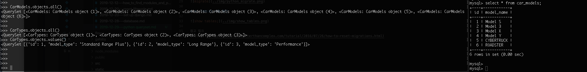
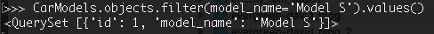
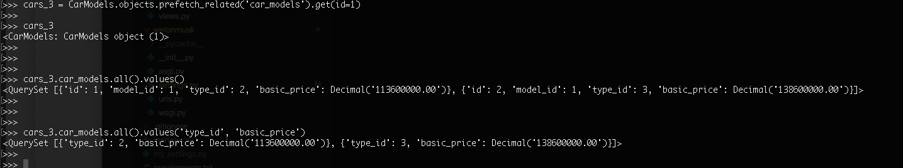

# 1. QUERY SET 이란
데이터 베이스에서 읽어온 객체들의 집합이다.
파이썬 쉘에서 다음과 같이 테이블 자료 조회



# 2. 특정 row만 가져오기 (MYSQL의 Where 구문)
```javascript
CarModels.objects.filter(model_name='Model S').values()
```


# 3. 읽어온 테이블에서 특정 키값만 필터링하기
value 함수에 원하는 키값을 전달해주면 다음과 같이 필터링 된다.



[Django reference]
> (https://docs.djangoproject.com/en/3.0/ref/models/querysets/)
