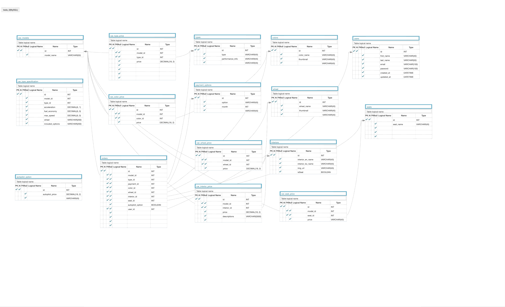

# 1. 프로젝트 내용
테슬라 한국 홈페이지(https://www.tesla.com/ko_kr) 주문 시스템 클론
# 2. 사용한 기술과 구현결과
파이썬, Django framework, MySQL, AWS EC2/RDS

모델 별로 선택 가능한 DB 관리, API 개발
선택 가능한 옵션을 Front End에 보내준 후에 가격에 반영하는 시스템 개발

효율적인 데이터 베이스 모델링으로 추가적인 모델 및 옵션 추가에 쉽게 대응 가능
API 문서화를 통하여 프론트 엔드개발자들과 효율적으로 커뮤니케이션 하였고, 리턴타입 검토시 효율적으로 수정 및 개선 가능하였음


API Documentation(https://documenter.getpostman.com/view/9816664/SWLcdorr?version=latest)

# 3. 후기 및 프로젝트 기간중 개선점
아쉬웠던 점은 탄소영향등 추가 데이터 베이스 구축은 프로젝트 기간상 하지 못하였음
특히, 프로젝트를 진행하면서 경험하였던 좋았던 점은 코드 개선 및 팀 협업 이었다.
자동차 가격을 쿼리 후에 해당정보를 리턴할때 for문안에서 또 다시 쿼리문을 작성하여서 성능 및 가독성도 떨어져서
리턴하는 리스트를 만들때 리스트 컴프리헨션(Comprehension) 기법으로 이를 개선
개선 결과, 수정사항 발생시 기민한 코드 수정이 가능하였음.<br>
개선전
```python
for car in type_list:
    car_type = CarTypes.objects.get(id=car['type_id'])
    car['model_type'] = car_type.model_type
    del car['type_id']

```
개선후
```python
type_list = [
{
      'model_name' : cars.model_name ,
      'basic_price' : car['basic_price'],
      'model_type' : CarTypes.objects.get(id=car['type_id']).model_type,
  } for car in list(cars.car_models.all().values()]
```

협업을 통하여 프론트에서 데이터베이스 업데이트 Fetch / 현재 종합된 가격 fetch 를 연속으로 호출 하였는데 옵션이 추가된 가격이 백엔드에서 리턴이 되지 않아서 결과가 리턴될때까지 기다리는 await fetch call로 개선하였음.<br>

데모영상
[](https://youtu.be/JQ6JGS6QFsQ)