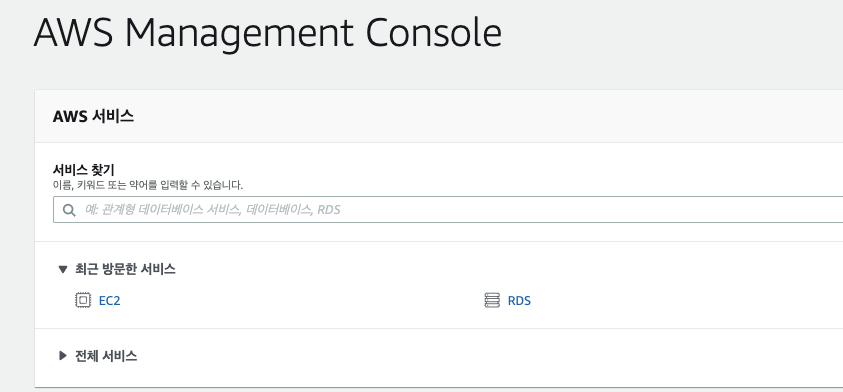
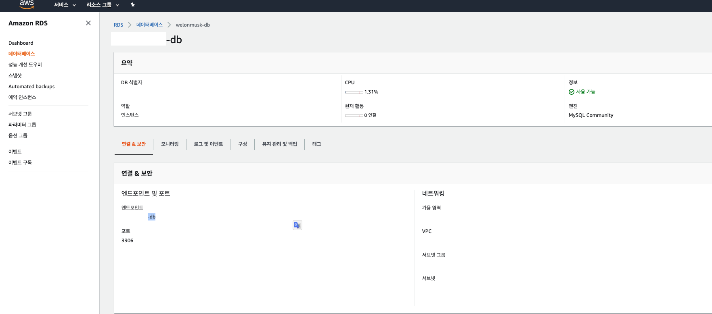
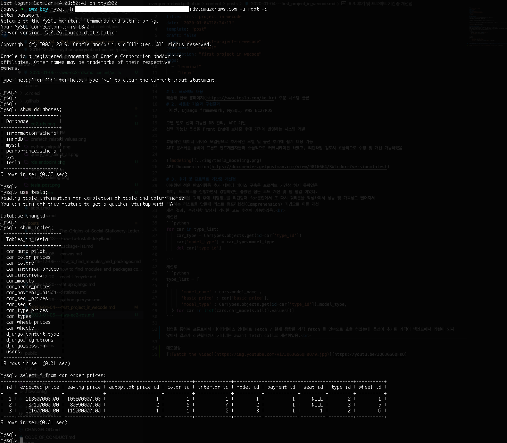
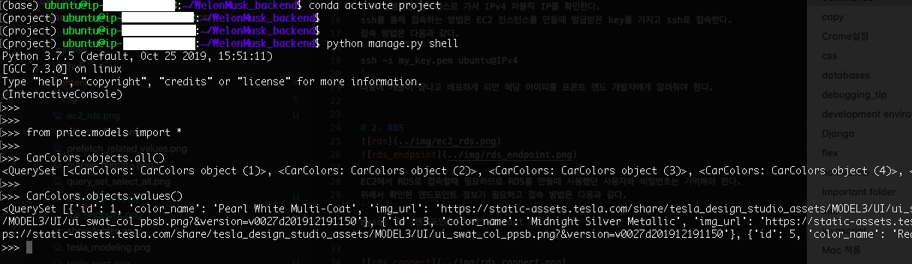

# 1. AWS 사용법
EC2 실행중인 인스턴스로 가서 IPv4 퍼블릭 IP를 확인한다.
ssh를 통해 접속하는 방법은 EC2 인스턴스를 만들때 발급받은 key를 가지고 ssh로 접속한다.
접속 방법은 다음과 같다. 
`
ssh -i my_key.pem ubuntu@IPv4
`
 나중에 개발이 끝나고 배포하게 되면 해당 아이피를 프론트 엔드 개발자에게 알려줘야 한다.

# 2. RDS 사용법

EC2에서 RDS로 접속할때 필요하므로 RDS를 만들때 사용했던 사용자와 비밀번호는 기억해야 한다.
위에서 확인한 엔드포인트 정보가 필요하고 접속 방법은 다음과 같다.
`
mysql -h [엔드포인트 주소] -u root -p
`

# 3. EC2에서 RDS로 DB 연결 확인
내컴퓨터에서 확인하는 방법과 마찬가지로 다음과 같이 EC2 서버에서 장고 ORM을 통하여 RDS에 구축되어 있는 데이터베이스의 테이블을 조회 할 수 있다.

# 4. API 테스트 방법
localhost 대신에 EC2의 IPv4 퍼블릭 IP로 바꿔서 테스트 한다.
http://localhost:8000/price/model/2
