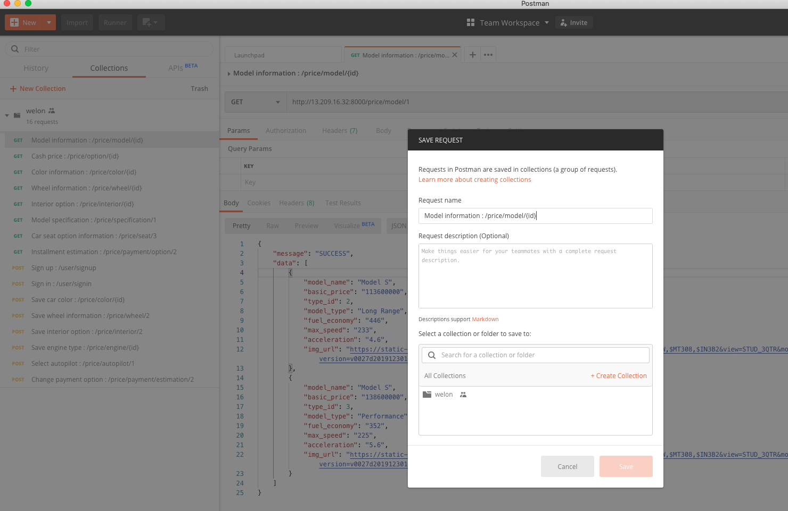
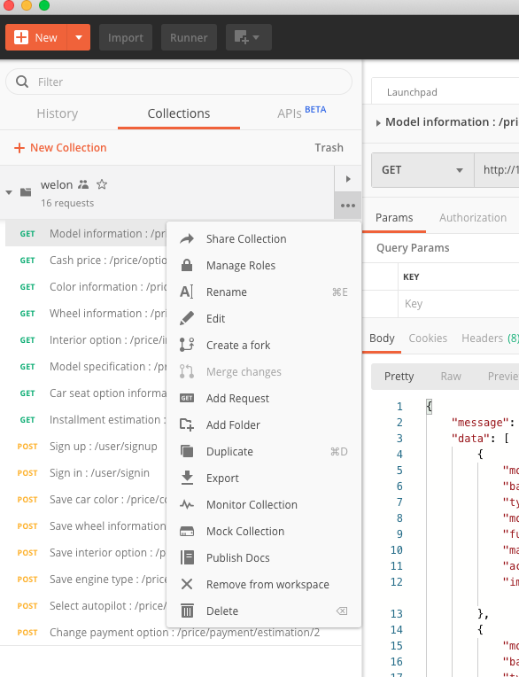
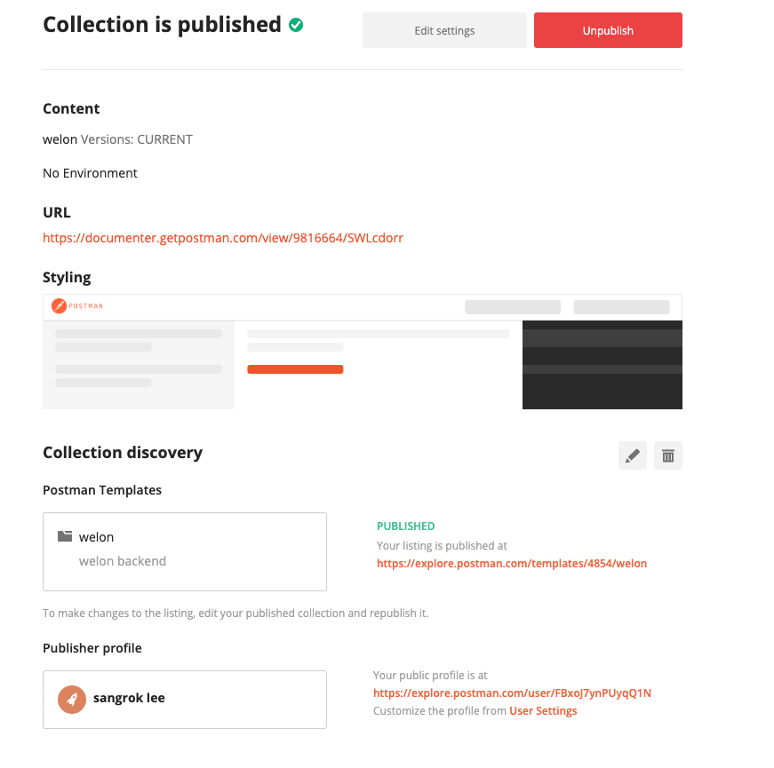
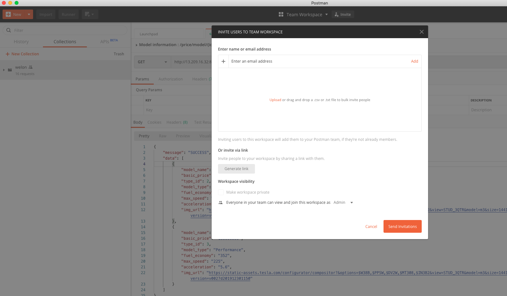
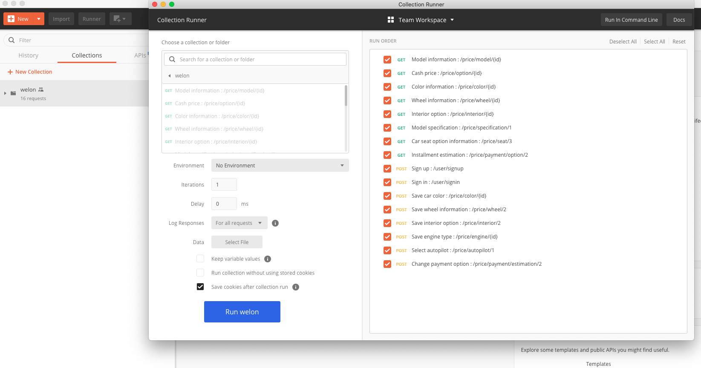
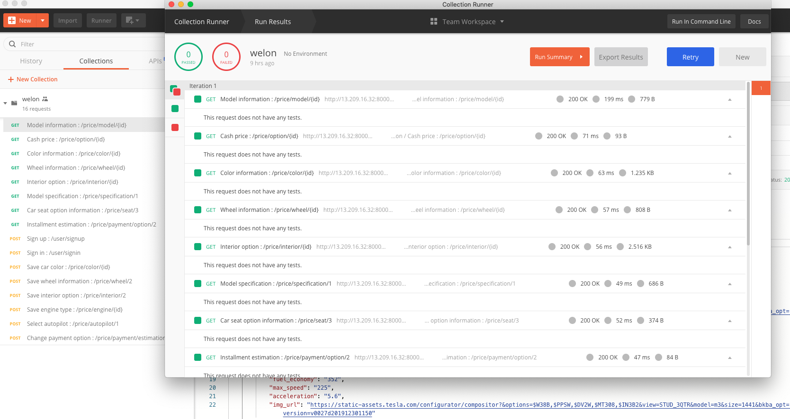
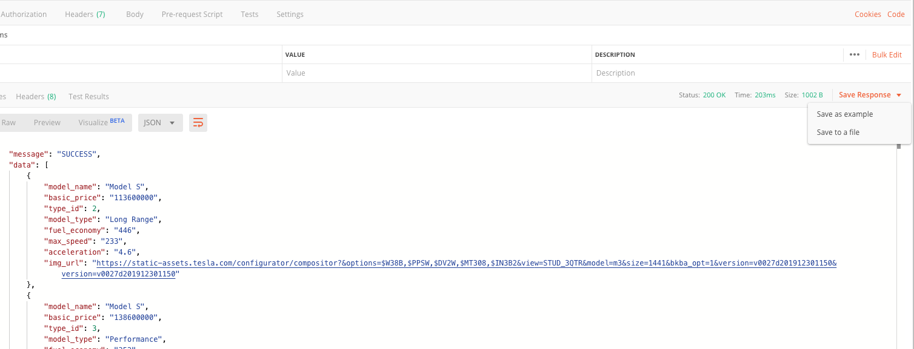

# 1. API Documentation
문서화를 위한 문서화가 아닌, 실제 테스트 완료된 API로써 Documentation이 가능하며 배포 후에도 기능 변경시 
유지/보수가 쉽다.
예를 들어, 내가 Endpoint API를 하나 구현하고 간단하게 바로 Documentation이 가능하다


개인적으로는 하기 템플릿을 사용하여 테스트후 즉시 Documentation을 하면 개발이 끝난 후에 따로 시간을 내서 정리하지 않아도
문서화가 가능한 장점이 있다.

<dl>
Description
<details>
 <summary>return</summary>

```js
some notes
```
</details>

</dl>

# 2. API 수정 및 배포 방법
수정 후 퍼블리시 하면 URL이 생성되며 URL을 관계자와 공유하면 된다.



# 3. 팀협업 
팀 워크 스페이스로 가서 New Collection 을 만들고 Invite로 초대를 보낸다<br>
팀원 전체가 API 수정 가능하며 개발전에도 이기능을 통하여 Input/Output 데이터 협의 가능함



# 4. Unit 테스트
Runner를 실행 후에 원하는 테스트를 선택하고 Run [Collection]으로 실행한다.
이기능을 활용하면 배포전 한번에 API Unit Test가 가능


Test 결과 리포트도 만들어줘서 다운로드 받을 수 있음.


# 5. 기타 기능
리턴된 Json 타입이 필요한 Response 다운로드 방법


