What is AWS Lambda ?
https://aws.amazon.com/lambda/

## 1. Create users table from dynamo db

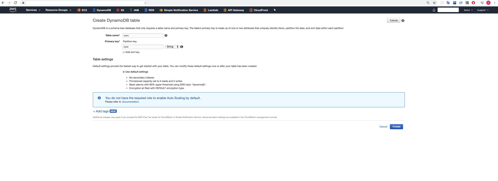

put data to the table for testing later like this

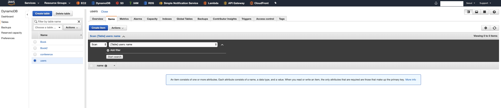

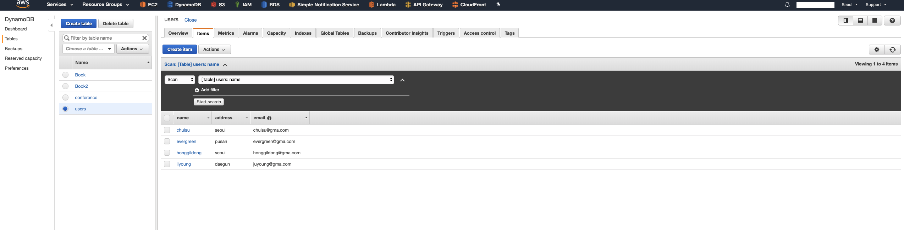

## 2. Create python lambda function to get data from dynamodb

Function name : getusers<br>
Runtime : Python 3.7

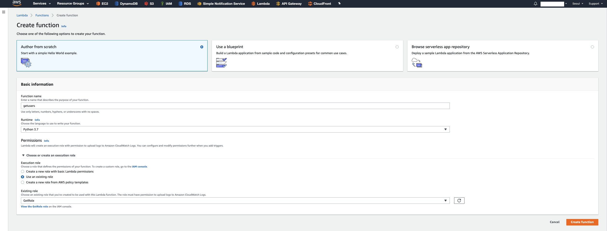

[Permissions] / Resource summary

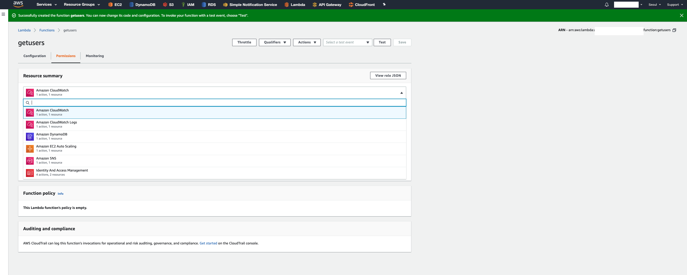

AWS Lambda Runtimes<br>
https://docs.aws.amazon.com/lambda/latest/dg//lambda-runtimes.html

AWS Lambda Limits
https://docs.aws.amazon.com/lambda/latest/dg//limits.html

AWS X-Ray
https://docs.aws.amazon.com/xray/latest/devguide/aws-xray.html

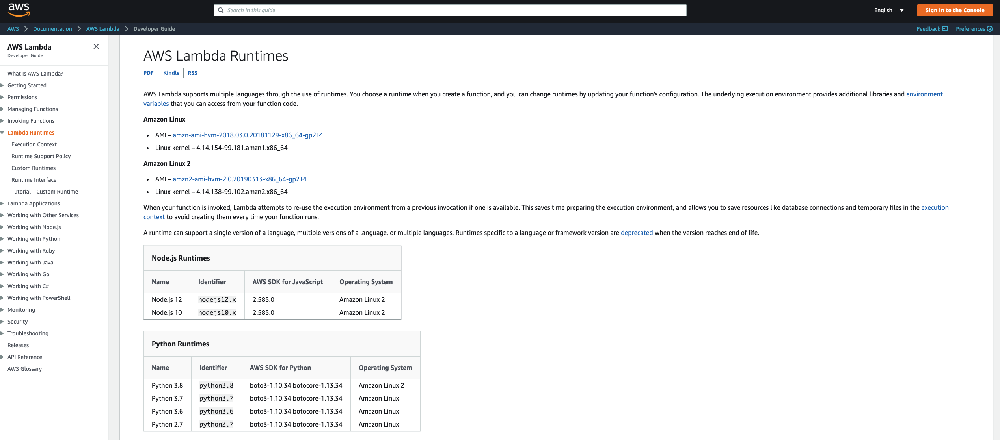

db access using boto3

boto3 documentation
https://boto3.amazonaws.com/v1/documentation/api/latest/index.html

[Available Services] -> find "dynamo" / "table"
https://boto3.amazonaws.com/v1/documentation/api/latest/reference/services/dynamodb.html#table

DynamoDB reference guide
https://boto3.amazonaws.com/v1/documentation/api/latest/reference/customizations/dynamodb.html#ref-valid-dynamodb-types

The following query syntax is used for this test.
```
    IndexName='string',
    Select='ALL_ATTRIBUTES'|'ALL_PROJECTED_ATTRIBUTES'|'SPECIFIC_ATTRIBUTES'|'COUNT',
    AttributesToGet=[
        'string',
    ],
    Limit=123,
    ConsistentRead=True|False,
    KeyConditions={
        'string': {
            'AttributeValueList': [
                'string'|123|Binary(b'bytes')|True|None|set(['string'])|set([123])|set([Binary(b'bytes')])|[]|{},
            ],
            'ComparisonOperator': 'EQ'|'NE'|'IN'|'LE'|'LT'|'GE'|'GT'|'BETWEEN'|'NOT_NULL'|'NULL'|'CONTAINS'|'NOT_CONTAINS'|'BEGINS_WITH'
        }
    },
    QueryFilter={
        'string': {
            'AttributeValueList': [
                'string'|123|Binary(b'bytes')|True|None|set(['string'])|set([123])|set([Binary(b'bytes')])|[]|{},
            ],
            'ComparisonOperator': 'EQ'|'NE'|'IN'|'LE'|'LT'|'GE'|'GT'|'BETWEEN'|'NOT_NULL'|'NULL'|'CONTAINS'|'NOT_CONTAINS'|'BEGINS_WITH'
        }
    },
    ConditionalOperator='AND'|'OR',
    ScanIndexForward=True|False,
    ExclusiveStartKey={
        'string': 'string'|123|Binary(b'bytes')|True|None|set(['string'])|set([123])|set([Binary(b'bytes')])|[]|{}
    },
    ReturnConsumedCapacity='INDEXES'|'TOTAL'|'NONE',
    ProjectionExpression='string',
    FilterExpression=Attr('myattribute').eq('myvalue'),
    KeyConditionExpression=Key('mykey').eq('myvalue'),
    ExpressionAttributeNames={
        'string': 'string'
    },
    ExpressionAttributeValues={
        'string': 'string'|123|Binary(b'bytes')|True|None|set(['string'])|set([123])|set([Binary(b'bytes')])|[]|{}
    }
)
```

Writing codes to get users from database

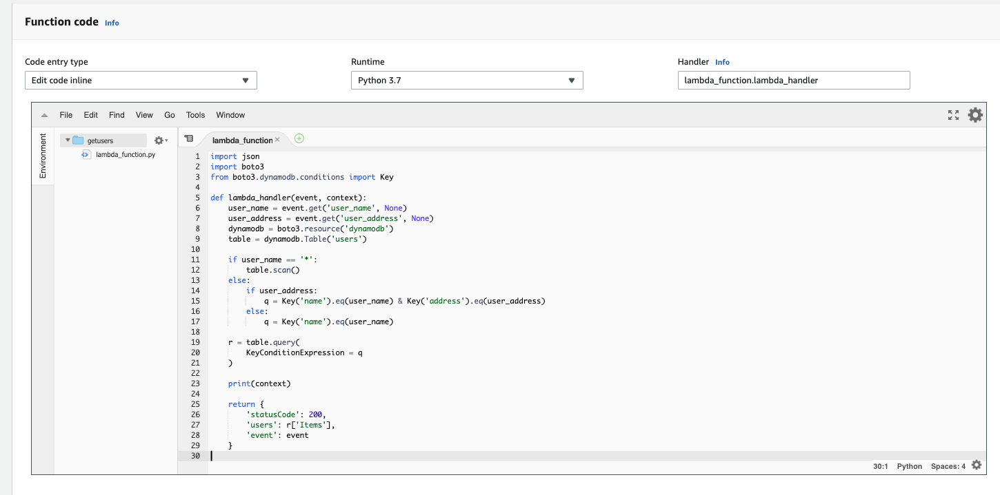

# 3. Writing Test case

[Configure test event]

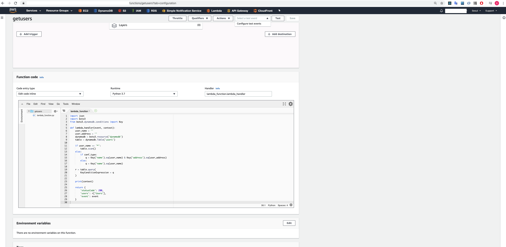

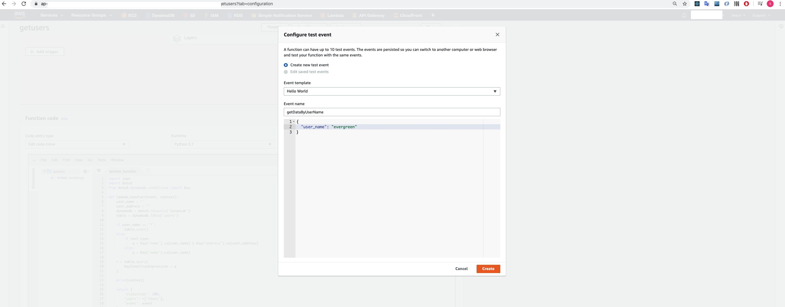
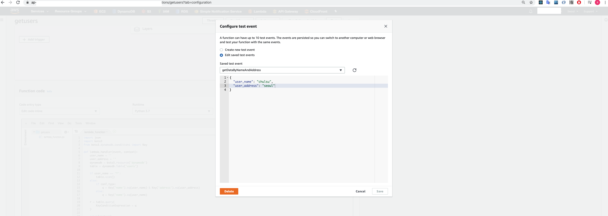

run test
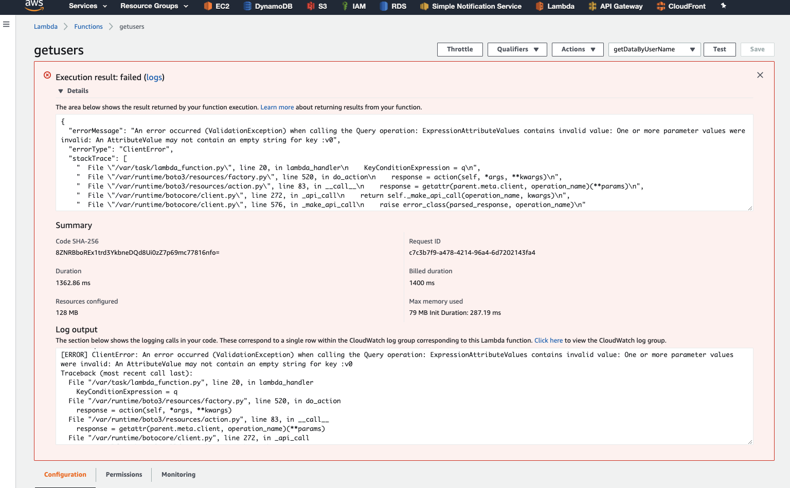

need debugging
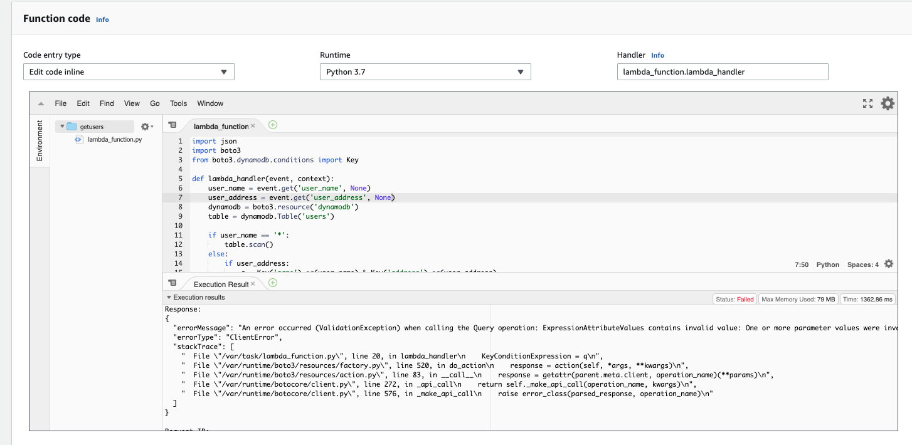


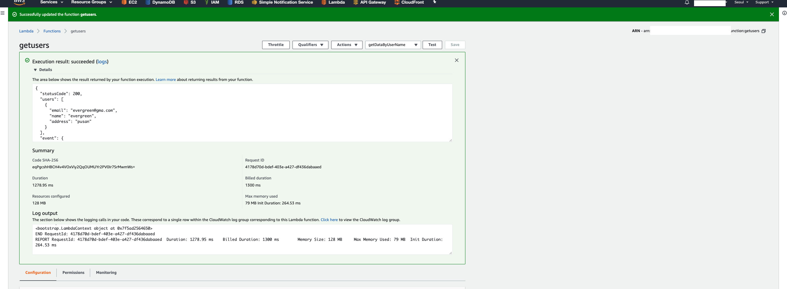

print contest to see the content of LambdaContext object

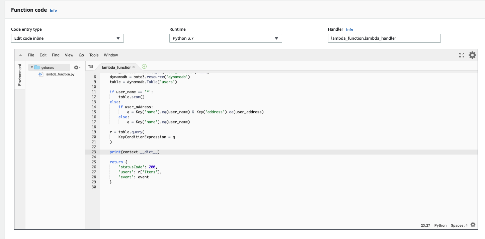

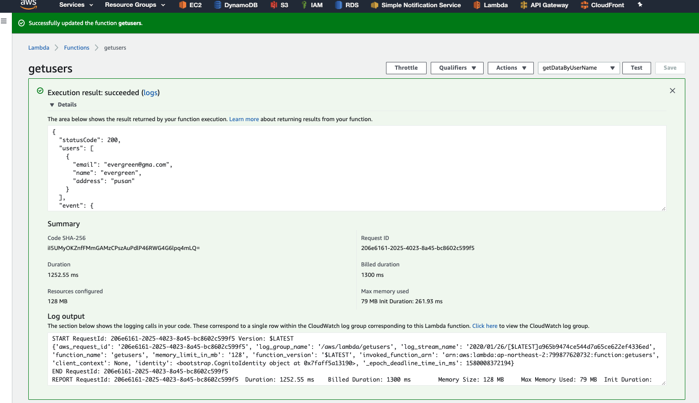


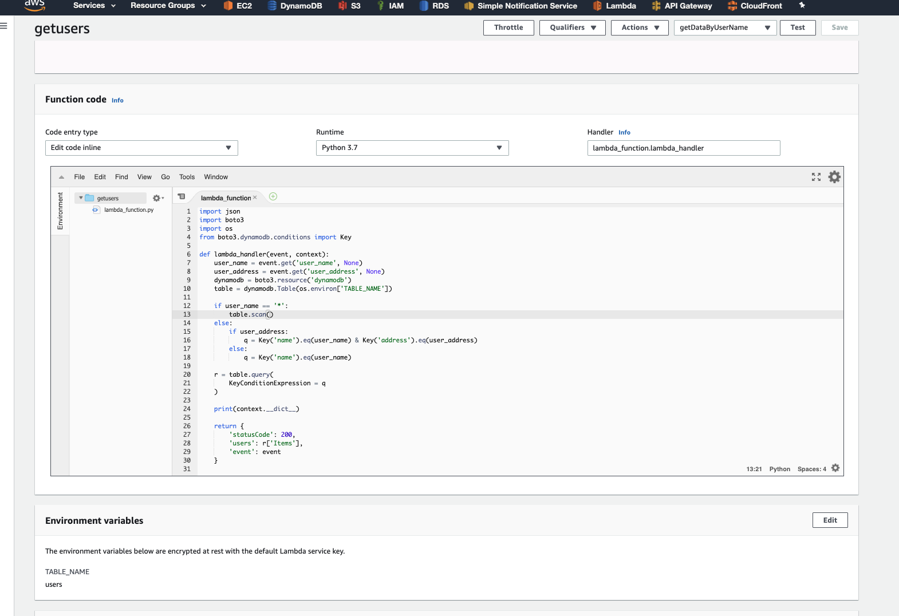

Cloud watch
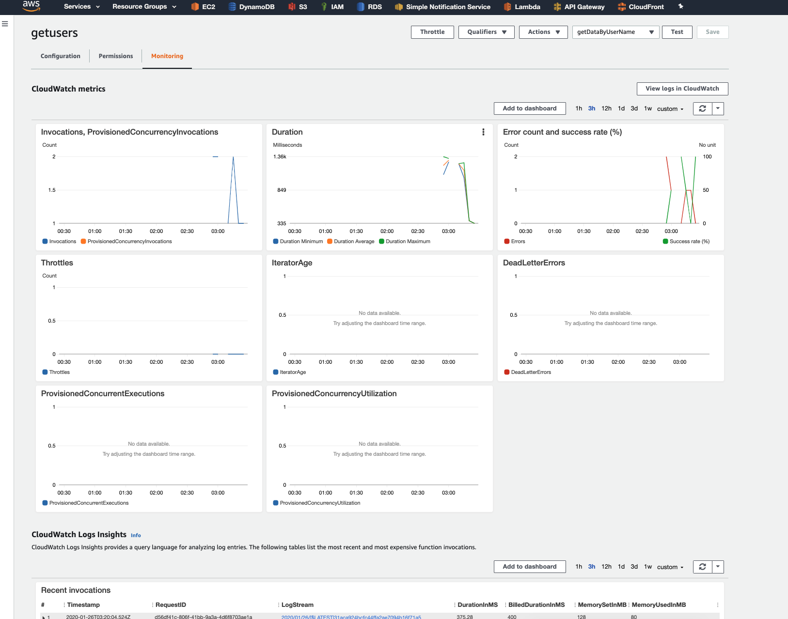


Test 2 succeed
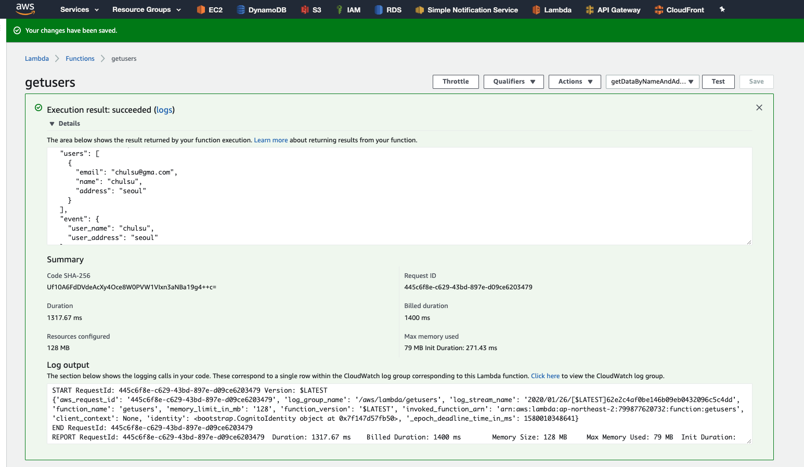

In summary, a get function using AWS lambda was made in Python 3.7 runtime environment.
