# 1. Deployment html file to AWS S3

In this article, the configuration of AWS S3 and CloudFront will be shown.
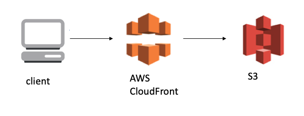

First, prepare for the source codes you want to deploy.

create bucket
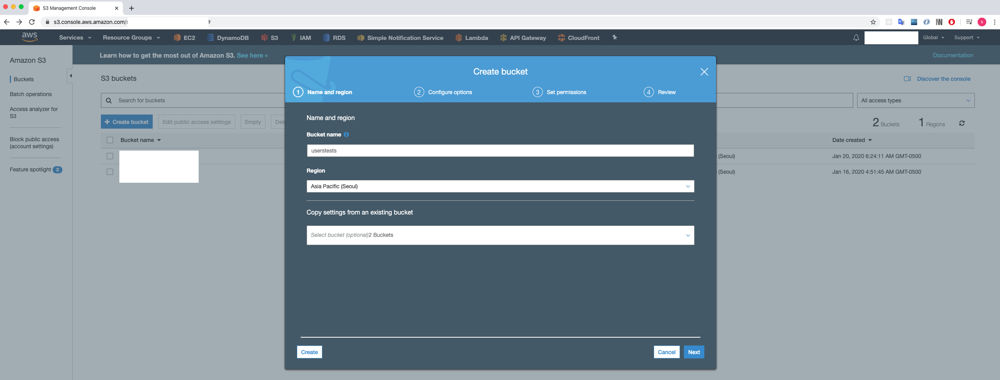

check 2 red boxes if you want to lock the object, but it doesn't need to be checked in this example.
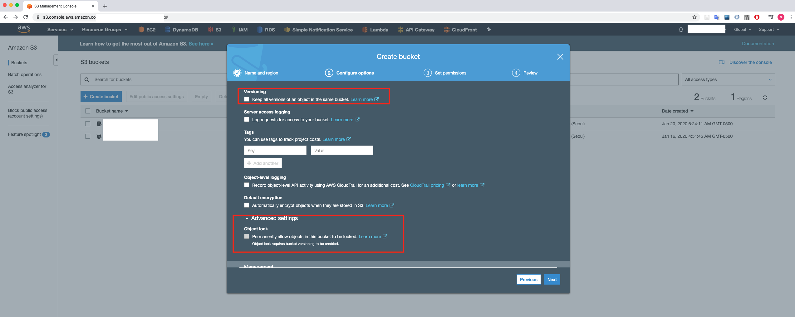

Upload html files
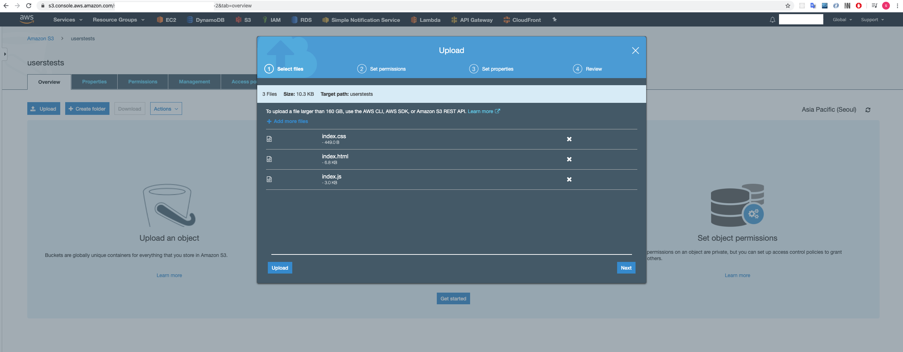
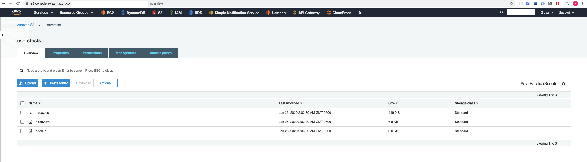

check the files using the aws cli

https://docs.aws.amazon.com/cli/latest/reference/s3api/list-objects.html

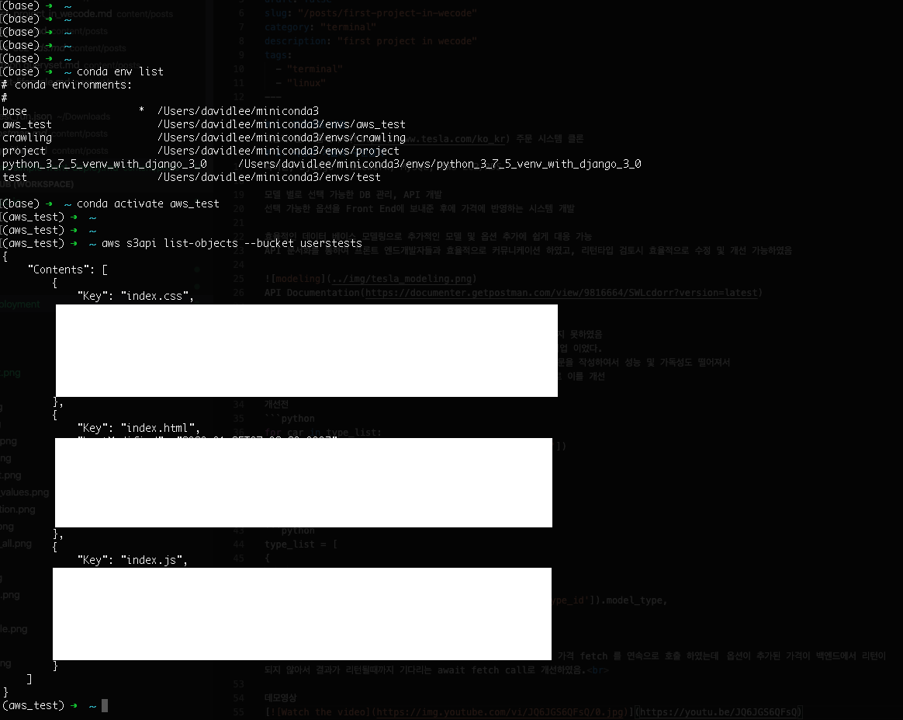

Currently, the following object url is not public. It means that the url is not permitted.

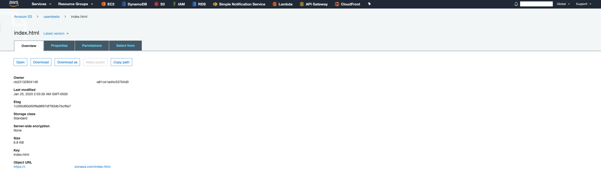
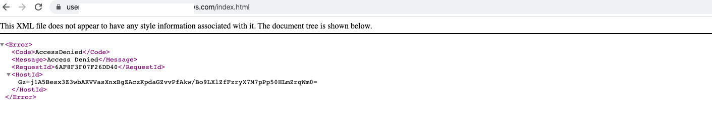

# 2. Setting permissions

I will not use the ACL, so I checked the 2 top boxes.

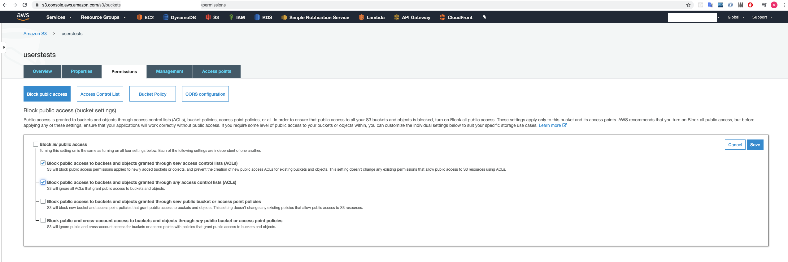

confirm the block access settings and go to Bucket Policy.

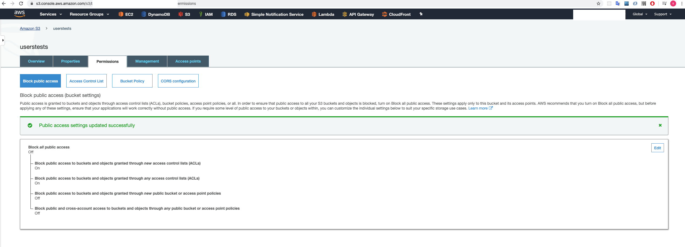
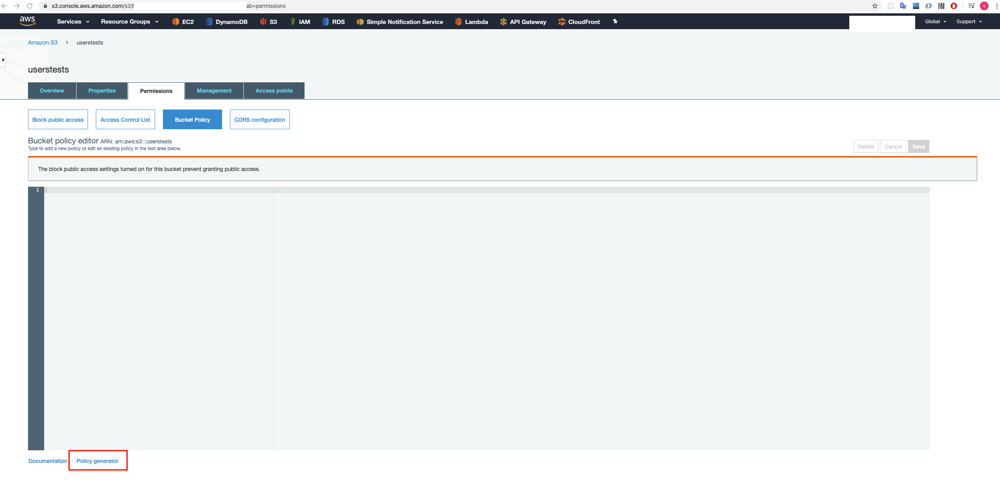

Input the following information and generate the policy.
```
Origin domain name : select a bucket you made
Object Caching : Customize
Default Root Object : index.html
```
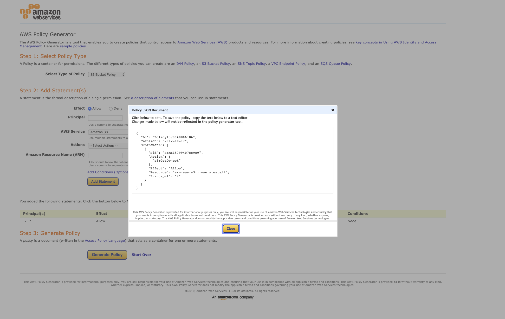

Copy the JSON and paste it to the policy editor.

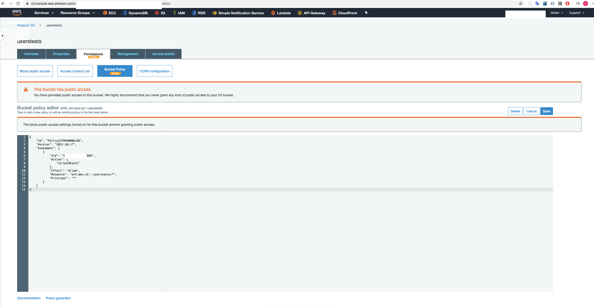

Now, I can access the website using the object url. We will combine S3 with the CloudFront and this access will be diabeld.
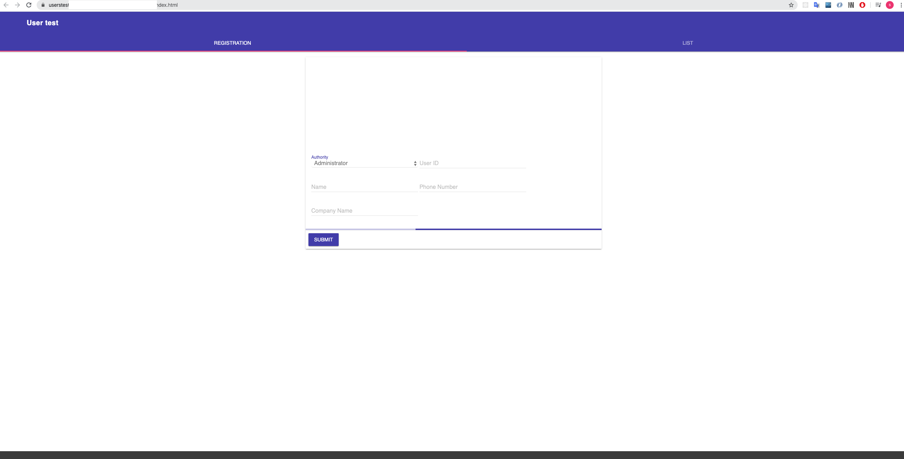

# 3. Static website hosting

Go to the Properties tab and Check "Use this bucket to host a website"

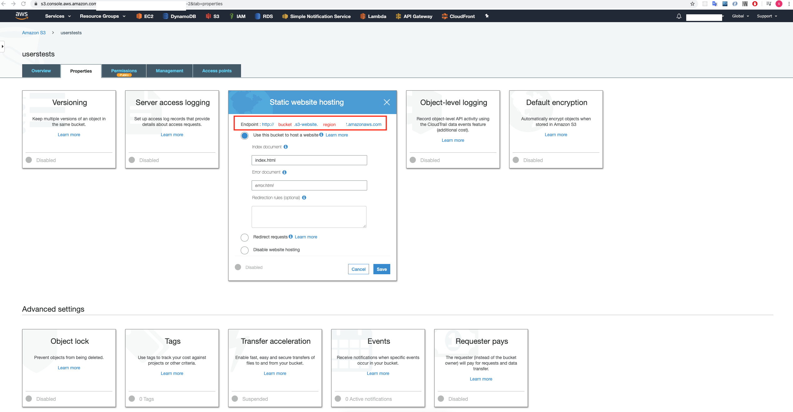

Now we can use that endpoint.

Enable the versioning to manage the history.

This event option is important because we can use that to get some events and process it.
For example, an image is deleted on S3 and then we need to delete the related information on Dynamo DB.
In that case, this option will be useful for that.

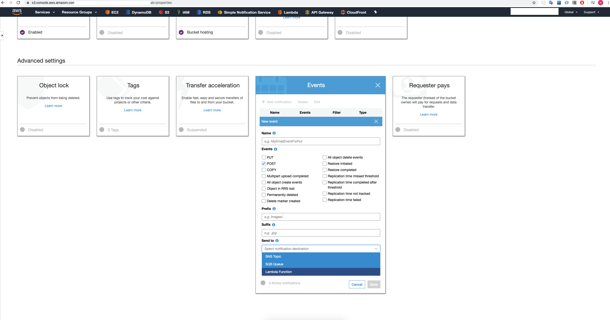

# 4. CloudFront Distribution

https://aws.amazon.com/cloudfront/
https://docs.aws.amazon.com/AmazonCloudFront/latest/DeveloperGuide/Introduction.html

[CloudFront] -> [Create Distribution] -> [Get Started]

https://docs.aws.amazon.com/lambda/latest/dg/lambda-edge.html

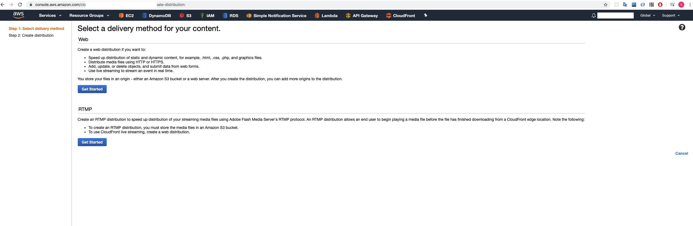

```
Origin domain name : select a bucket you made
Object Caching : Customize
Default Root Object : index.html
```

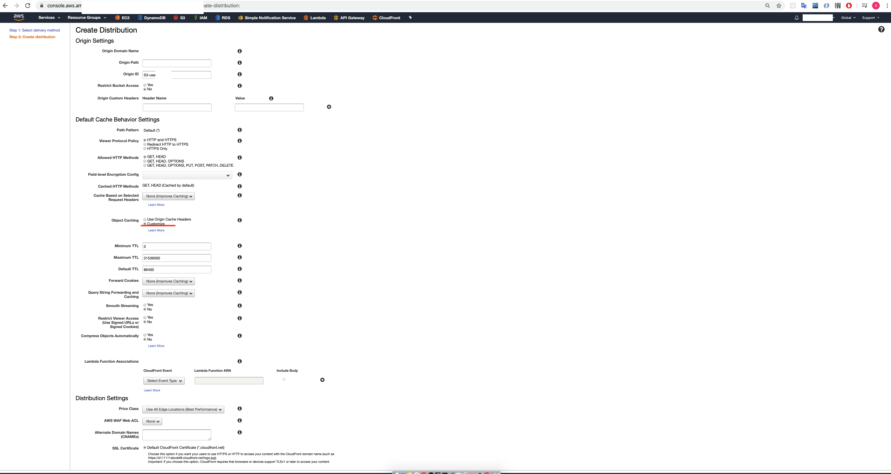

[CloudFront] -> [ID] -> [Origins and Origin Groups] -> [Edit] -> [Restrict Bucket Access] -> [Yes]

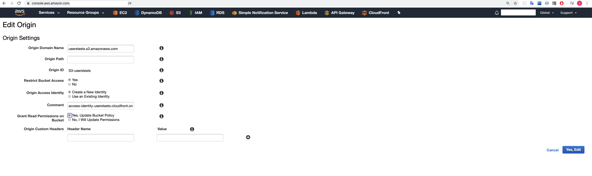

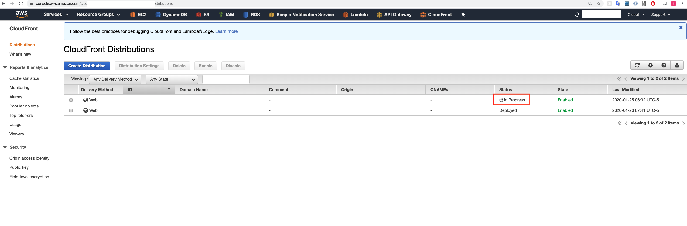

After fishing deploying, go to the policy of the bucket permissions to check the modification.
Now it doesn't allow the access to the html file using the object URL and the endpoint of static website hosting.


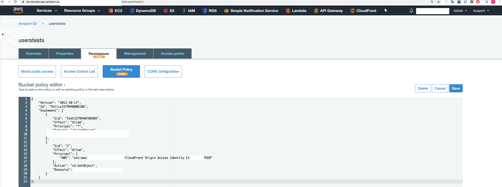
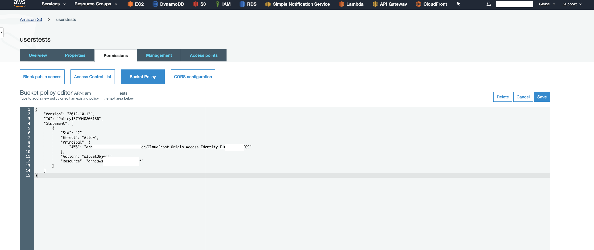

Finally, the domain name of CloudFront can be used to connect the index html on S3.
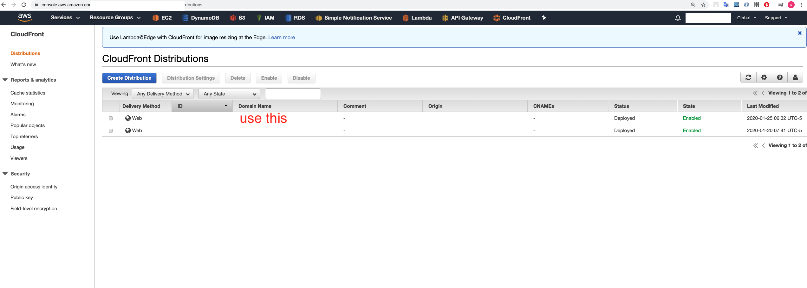
