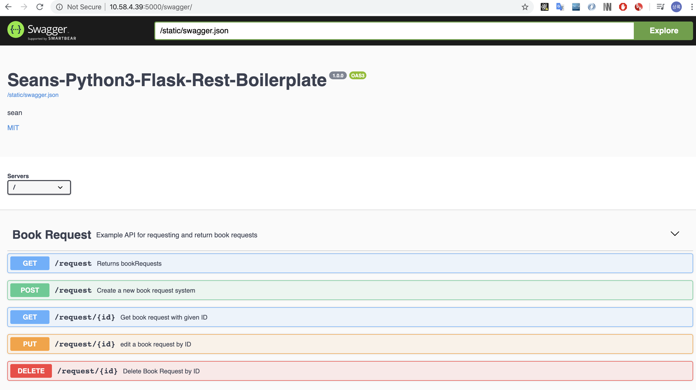

# 1. swagger-ui 로 API 정리가 필요한 이유
하기와 같이 포스트맨으로 API를 Documentation 하고 있었지만, 기업 협업을 할때 공동작업시 버전 관리가 안되는 문제가 있었다.

그래서 다음과 같이 간단하게 git에 올릴수 있는 swagger ui를 사용하여 git을 통한 변경관리 할 예정이다.
라이센스도 MIT 라이센스라서 무료로 사용할 수 있다.

참고 영상
> https://www.youtube.com/watch?reload=9&v=iZ2Tah3IxQc

